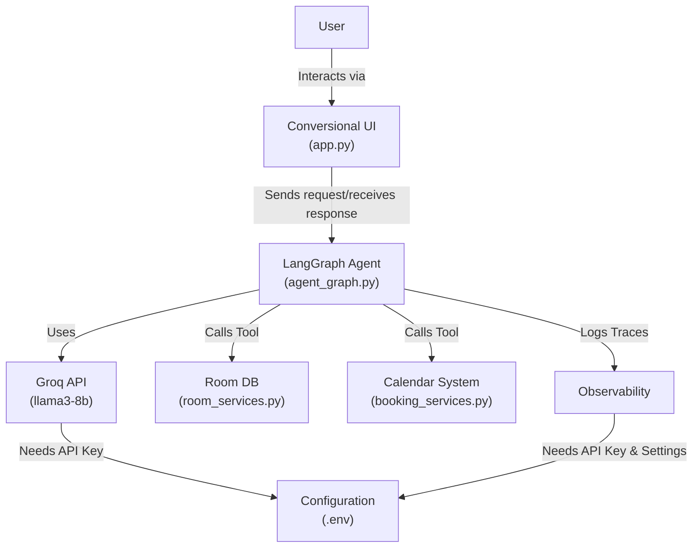
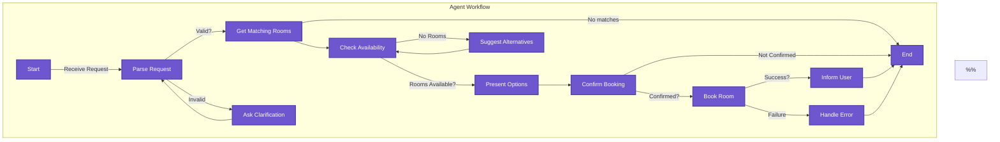

This LangGraph-based AI agent to help users find and reserve meeting rooms. The system will be built using the `LangGraph` framework to create a robust and flexible solution.
## Components

1.  **User Interface (UI) Agent:** For interacting with the user. The UI can be a chat interface using `Streamlit`.
2. **AI Agent :** Use `LangGraph` with LLM for booking rooms using `Groq API` and other tools.
3. **Room Database:** Mock API for room details.
4. **Calendar System:** Mock API for availability and bookings.
5. **Observability:** Logs traces for observability using `LangSmith`.
## Architecture Diagram (Conceptual):



## Tools
- **Groq API:** For parsing user requests. 
- **LangGraph:** Defines workflow with nodes (parse, query, book) and conditional edges. 
- **LangSmith:** Logs traces for monitoring.
- **Streamlit:** Interactive conversional user interface.
## Databases

The data  files were **synthetically generated by an AI assistant** for prototyping purposes. I chose JSON files because:
1. **No database overhead** during prototyping.
2. **Human-readable and editable** for small-scale room/booking data.
3. **Native compatibility** with Python’s `json` module.
4. **Easy validation** of data formats using Pydantic models.

> **Limitation of JSON**: No support for concurrent write access. If you later deploy this for multiple users, you’ll need a real database that handles **transactions** and **locking** safely.
## Schemas
**Rooms.json**
```json
[
  {
    "id": 1,
    "name": "Room1",
    "capacity": 4,
    "equipments": ["Projector", "Whiteboard"]
  }
]
```
**Bookings.json**
```json
[
  {
    "room_id": 1,
    "start_time": "2025-05-10T10:00:00",
    "end_time": "2025-05-10T11:00:00",
    "booked_by": "Heba Mohamed"
  }
]
```
## Agent Workflow and State (LangGraph)



## Agent State
LangGraph flows pass around a **shared state dictionary**. Define it clearly to make it easy to update nodes later.

| **Key**             | **Type**          | **Description**                                 |
| ------------------- | ----------------- | ----------------------------------------------- |
| `user_input`        | `str`             | Raw input from the user                         |
| `valid`             | `bool`            | Whether input parsing was successful            |
| `equipments`        | List[Room]        | Parsed desired features (e.g., `["Projector"]`) |
| `capacity`          | `int` (optional)  | Required room capacity                          |
| `time_slot          | `Tuple[str, str]` | Booking time in ISO format (start, end)         |
| `matched_rooms`     | `List[dict]`      | Rooms matching the desired features             |
| `available_rooms`   | `List[dict]`      | Subset of matched rooms that are available      |
| `selected_room`     | `dict` or `None`  | The room selected by the user                   |
| `booking_confirmed` | `bool` or `None`  | Whether user confirmed the booking              |
| `booking_success`   | `bool` or `None`  | Whether booking succeeded                       |
| `message`           | `str` (optional)  | A message to display to the user                |
## Nodes List

| Node Name              | Role                                                              |
| ---------------------- | ----------------------------------------------------------------- |
| Parse Request          | Parse user's request, extract room type, equipments and time slot |
| `ask_clarification`    | Ask for missing data (LLM response or placeholder now)            |
| `get_matching_rooms`   | Find rooms that meet user preferences                             |
| `check_availability`   | Check time availability of matched rooms                          |
| `suggest_alternatives` | Suggest rooms at other times or with fewer features               |
| `present_options`      | Show available rooms to the user                                  |
| `confirm_booking`      | Ask the user if they want to proceed                              |
| `book_room`            | Run the `book_room()` function                                    |
| `inform_user`          | Confirm success and send message                                  |
| `handle_error`         | If booking fails, explain why                                     |
## Conditions List

| **Condition Name**           | **Role**                                                                    | **Returns**                                        |
| ---------------------------- | --------------------------------------------------------------------------- | -------------------------------------------------- |
| Check Valid Request          | Determines if the user’s input is complete (has time, equipments, etc.)     | `"get_matching_rooms"` or `"ask_clarification"`    |
| Matching Rooms Exist         | Checks if any rooms match the user’s required features                      | `"check_availability"` or `"suggest_alternatives"` |
| Available Booking Time Exist | Checks if any of the matched rooms are available in the selected time range | `"present_options"` or `"suggest_alternatives"`    |
| User Confirms Booking        | Determines if the user confirmed the booking (yes/no)                       | `"book_room"` or `"end"`                           |
| Booking Success              | Checks if booking was successfully saved                                    | `"inform_user"` or `"handle_error"`                |
## Directory Structure

```tree
room_booking_agent/
├── data/             
│   ├── rooms.json            # Syntactic JSONL data contains 30 sample rooms
│   └── bookings.json        # Syntactic JSONL data contains 10 sample bookings
│
└── src/
    ├── mock_apis/           # Mock API implementations
    │   ├── booking_services.py
    │   └── room_services.py
    ├── agent.py              # Core agent logic
    ├── config.py             # Configuration settings
    └── main.py               # Entry point for the application
```
## Implementation Details


#### **Parse Request Function**


```python
    # Define the function to parse the request

    # This function will be called when the agent is initialized

    # It will take the original request and parse it into a structured format

    # The parsed request will be stored in the state

    # The function will also check if clarification is needed

    # If clarification is needed, it will set the clarification_needed flag to True

    # and set the clarification_question to the question that needs to be asked

    # If no clarification is needed, it will set the clarification_needed flag to False

    # and proceed to the next step in the workflow

    # The function will return the parsed request and the clarification_needed flag

    # The function will also return the clarification_question if clarification is needed

    # Example request: "I want to book a room for 2 people on 2023-10-01"

    # ########## parsed request: {"room_type": "double", "date": "2023-10-01", "people": 2}

    # ########## response: {"parsed_request": {"room_type": "double", "date": "2023-10-01", "people": 2},

    # ########## "clarification_needed": False, "clarification_question": None}
```


| **Condition Name**    | **Function Name**            | **Purpose**                                                                 | **Returns**                                        |
| --------------------- | ---------------------------- | --------------------------------------------------------------------------- | -------------------------------------------------- |
| Check Valid Request   | `is_valid_request(state)`    | Determines if the user’s input is complete (has time, features, etc.)       | `"get_matching_rooms"` or `"ask_clarification"`    |
| Matching Rooms Exist  | `any_matching_rooms(state)`  | Checks if any rooms match the user’s required features                      | `"check_availability"` or `"suggest_alternatives"` |
| Available Rooms Exist | `any_available_rooms(state)` | Checks if any of the matched rooms are available in the selected time range | `"present_options"` or `"suggest_alternatives"`    |
| User Confirms Booking | `should_book_room(state)`    | Determines if the user confirmed the booking (yes/no)                       | `"book_room"` or `"end"`                           |
| Booking Success       | `booking_successful(state)`  | Checks if booking was successfully saved                                    | `"inform_user"` or `"handle_error"`                |