This LangGraph-based AI agent to help users find and reserve meeting rooms. The system will be built using the `LangGraph` framework to create a robust and flexible solution.

A LangGraph-based AI agent to help users find and reserve meeting rooms. The system uses Groq API (with support for other LLMs like Ollama) and implements a complete booking workflow with room availability checks.

## Features

- Natural language processing for meeting room requests
- Room availability checking and booking
- Flexible workflow with user clarification loops
- Simple web interface for interaction
- JSON-based database for prototyping

## Components

1. **User Interface (UI):** For interacting with the user. I used simple html ans css template for prototyping.
2. **AI Agent :** Use `LangGraph` with LLM for booking rooms using main `Groq API` and support other LLMs like Ollama.
3. **Room and Booking Database:** Simple Json files as a dummy NoSQL data.
4. **Calendar Booking System:** Mock API for availability and bookings.

<p align="center">
  
</p>

## Tools

| Tool | Purpose | Configuration | Data Flow |
|------|---------|---------------|-----------|
| **Groq API** | • LLM-powered request parsing<br>• Field extraction & validation | • `model_name=llama3-8b-8192`<br>• `temperature=0.5` | User input → Groq API→ Structured `BookingRequest` |
| **LangGraph** | • Workflow orchestration<br>• State management | • Nodes: `parse`, `query_rooms`, `book_room`<br>• Edges: Conditional transitions | `AgentState` → LangGraph → Updated `AgentState` |
| **Flask** | • Web interface<br>• Session management | • REST endpoints<br>• Jinja2 templating | User Interaction ↔ Flask API ↔ Agent System |
| **HTML/CSS** | • Responsive UI<br>• Booking forms | • Bootstrap integration<br>• Custom CSS variables | Rendered via Flask templates |

## Databases

The data  files were **synthetically generated by an AI assistant** for prototyping purposes. I chose JSON files because:
1. **No database overhead** during prototyping.
2. **Human-readable and editable** for small-scale room/booking data.
3. **Native compatibility** with Python’s `json` module.
4. **Easy validation** of data formats using Pydantic models.

> **Limitation of JSON**: No support for concurrent write access. If you later deploy this for multiple users, you’ll need a real database that handles **transactions** and **locking** safely.
## Database Schemas
### Rooms Structure

```json
[
  {
    "id": 1,
    "name": "Room1",
    "capacity": 4,
    "equipments": ["Projector", "Whiteboard"]
  }
]
```
###  Bookings Structure

- **Room ID** → Booking's foreign key
- **Time Format** → ISO8601 (UTC)
- **Array-Based** → Multiple bookings per room

```json
{
    "3": [
        {
            "start_time": "2025-05-10T08:00:00",
            "end_time": "2025-05-10T09:30:00",
            "booked_by": "Yasmin El-Sayed"
        },
        {
          ...
        }
    ],

    "1": [
        {
            "start_time": "2025-05-10T13:00:00",
            "end_time": "2025-05-10T15:00:00",
            "booked_by": "Omar Khaled"
        },
        ...
    ]
}
```
## Agent Workflow and State (LangGraph)

<p align="center">
  
</p>


## Nodes List Descriptions

| Node Name               | Type        | Description                                                                 |
|-------------------------|-------------|-----------------------------------------------------------------------------|
| **EntryPoint**          | Trigger     | Initiates the booking workflow                                              |
| **ParseRequest**        | Validation  | Extracts meeting requirements (time, capacity, equipment)                   |
| **RequestClarification**| Interaction | Asks user for missing details (loops back to ParseRequest)                  |
| **FindRooms**           | Query       | Identifies rooms matching requirements                                      |
| **CheckAvailability**   | Verification| Checks calendar for free slots in candidate rooms                           |
| **SuggestChanges**      | Fallback    | Proposes alternative times/features (loops to recheck availability)         |
| **ShowOptions**         | UI          | Displays available rooms to user                                            |
| **GetConfirmation**     | Interaction | Requests final approval from user                                           |
| **ReserveRoom**         | Action      | Attempts to book the room in the system                                     |
| **SendConfirmation**    | Notification| Notifies user for the successful booking                                    |
| **HandleFailure**       | Error       | Manages booking errors (conflicts, system issues)                           |
| **End**                 | Terminal    | Final state (success or failure)                                            |


## **Transition Logic**

| From Node            | Condition Label               | To Node              | Business Rule                                                                 |
|----------------------|-------------------------------|----------------------|-------------------------------------------------------------------------------|
| EntryPoint           | 📩 User Request               | ParseRequest         | Always triggers on new request                                                |
| ParseRequest         | ✅ Valid Input                | FindRooms            | When all required fields (time, capacity, equipment) are provided            |
| ParseRequest         | ❌ Missing Info               | RequestClarification | When critical info is incomplete                                              |
| FindRooms            | 🔍 No Matching Rooms          | End                  | Terminates if no rooms match requirements                                     |
| FindRooms            | 🏨 Rooms Found                | CheckAvailability    | Proceeds with room candidates                                                 |
| CheckAvailability    | 🟢 Slots Available            | ShowOptions          | Shows available rooms with free slots                                         |
| CheckAvailability    | 🔴 Fully Booked               | SuggestChanges       | Triggers alternative suggestions                                              |
| GetConfirmation      | 👍 User Confirms              | ReserveRoom          | Books the selected room                                                       |
| GetConfirmation      | 👎 User Rejects               | End                  | Aborts if user declines options                                               |
| ReserveRoom          | 📅 Booking Success            | SendConfirmation     | On successful calendar update                                                 |
| ReserveRoom          | ⚠️ System Error              | HandleFailure        | On database/APIs failures                                                     |


## Agent State
LangGraph flows pass around a **shared state dictionary**. Using pydantic to define this state schema.

| Field | Type | Description | Example | Handling Logic |
|-------|------|-------------|---------|----------------|
| **user_input** | `str` | Raw user text | `"Book room for 4 with projector"` | Persisted for audit trails |
| **messages** | `List[ChatMessage]` | Full conversation context | `[HumanMessage(content="Hi..."), ...]` | Maintained for conversation memory |
| **parsed_request** | `Optional[Dict]` | Structured requirements | `{"time": "2025-05-10T14:00", "capacity": 4}` | Populated by LLM parsing |
| **clarification_needed** | `bool` | Missing data flag | `True` when time is missing | Triggers clarification loop |
| **clarification_question** | `Optional[str]` | Follow-up question | `"What time should I book?"` | Generated by LLM when `clarification_needed=True` |
| **user_name_for_booking** | `Optional[str]` | Extracted contact | `"Yasmin El-Sayed"` | From user_input or auth context |
| **matching_rooms** | `Optional[List[Dict]]` | Capacity/equipment matches | `[{"id": 1, "name": "Emerald", ...}]` | First filter step |
| **available_rooms** | `Optional[List[Dict]]` | Time-filtered matches | Subset of `matching_rooms` | Second filter step |
| **alternative_rooms** | `Optional[List[Dict]]` | Fallback options | Rooms with different times/features | Generated when no exact matches |
| **selected_room** | `Optional[Dict]` | User's choice | `{"id": 3, "name": "Sapphire"}` | Set during confirmation |
| **user_booking_confirmation** | `Optional[Literal["yes","no"]]` | Explicit approval | `"yes"` | Required before booking |
| **booking_result** | `Optional[bool]` | Success status | `True` if booked | Updated after API call |
| **error_message** | `Optional[str]` | Failure details | `"Conflict: Room booked at 14:00"` | Logged for troubleshooting |

## Parsed Request Schema

| Field | Type | Required | Default | Validation Rules | Example |
|-------|------|----------|---------|------------------|---------|
| **start_date** | `Optional[str]` | Conditional | `None` | Future date, YYYY-MM-DD or relative terms | `"2025-05-12"`, `"tomorrow"` |
| **start_time** | `Optional[str]` | Conditional | `None` | Future time, HH:MM:SS AM/PM or relative terms | `"02:30:00 PM"`, `"in 2 hours"` |
| **duration_hours** | `Optional[float]` | Yes (if booking) | `None` | > 0, accepts decimals | `1.5` (90 mins) |
| **capacity** | `Optional[int]` | No | `None` | > 0 if provided | `4` |
| **equipments** | `Optional[List[str]]` | No | `[]` | Non-empty strings | `["projector"]`, `["nothing"]` |
| **user_name** | `Optional[str]` | No | `None` | - | `"Yasmin El-Sayed"` |
| **clarification_needed** | `bool` | Auto-set | `False` | `True` when critical fields missing | `True` (if no time provided) |
| **clarification_question** | `Optional[str]` | Auto-gen | `None` | Human-readable question | `"How many attendees?"` |

#### **Parsing Rules**

| Condition | Action | Next State |
|-----------|--------|------------|
| Missing `start_date`/`start_time` | Set `clarification_needed=True`, generate `clarification_question` | Wait for user reply |
| Relative time/date (e.g., "tomorrow") | Convert to absolute datetime | Proceed to room search |
| `capacity=None` or `equipments=[]` | Treat as no preference | Filter rooms without capacity/equipment checks |
| Invalid future datetime | Set `clarification_needed=True`, ask for new time | Re-validate |
| All required fields valid | `clarification_needed=False` | Proceed to booking |

## System Prompt Details

The system prompt defines the rules and instructions governing the Meeting Room Booking Agent, an AI system that parses user requests and initiates room reservations. The agent adheres to **strict JSON-based** input/output schemas and handles natural language queries with clarification fallbacks. My prompt covers the following instructions/rules.

#### **Agent Identity**  
- **Role**: AI-powered meeting room booking assistant called **`Mando`**. 
- **Communication Style**: Friendly, professional, with optional emojis (e.g., ✅, ⏰)  
- **Output Format**: Exclusively JSON (no free-text responses). the schema defined in the previous section.

#### **Supported roles**  
- Booking new meetings.  
- Providing room availability.  
- Handling time/date ambiguities.  
- Answering greeting messages.

#### **Out-of-Scope Queries**  
- Non-booking inquiries (e.g., "What's the weather?").
- Historical data queries.
- Multi-room bookings.

#### **Parsing Data Rules**  
| Field | Rules | Examples |  
|-------|-------|----------|  
| **start_date** | • Converts relative terms (`today`/`tomorrow`/`next Monday`) → `YYYY-MM-DD`<br>• Past dates → Reject with clarification | `"2025-05-20"`, `"tomorrow"` |  
| **start_time** | • `HH:MM:SS AM/PM` required<br>• Missing AM/PM → Assume AM + flag for confirmation<br>• Relative times (`in 2 hours`) → Auto-convert | `"02:30:00 PM"`, `"in 1 hour"` |  
| **duration_hours** | • Must be `> 0`<br>• Supports decimals (`0.5` = 30 mins) | `1.5` (90 minutes) |  
| **capacity** | • `> 0` or `null` if unspecified | `4`, `null` |  
| **equipments** | • List or `["nothing"]`<br>• Case-insensitive | `["projector", "whiteboard"]` |  
| **user_name** | • Extracted from input or asked politely | `"Heba Mohamed"` |  

### **Trigger Conditions**  
| Scenario | Action |  
|----------|--------|  
| **Greeting-only messages** (e.g., "Hi") | Set all fields `null`, `clarification_needed=True`, respond: `"Hi! How can I help you book a room?"` |  
| **Missing critical fields** (date/time/duration) | Flag missing field(s) with specific question: `"What time should I book?"` |  
| **Ambiguous time** (no AM/PM) | Assume AM but ask: `"Did you mean 10:00 AM or PM?"` |  
| **Past datetime** | Reject: `"This time has passed. Please provide a future time."` |  


## Directory Structure

```
room_booking_agent/
│   app.py                - Main Flask application
│   config.py             - Configuration settings
│   helper.py             - Utility functions
│   
├───booking_agent         - Core agent components
│       conditions.py      - Transition conditions
│       nodes.py           - Nodes defination
│       prompt_config.py   - System prompts template text
│       schemas.py         - Pydantic models
│       workflow.py        - LangGraph workflow definition
│
├───mock_apis             - Mock services
│       booking_services.py - Booking API simulation
│       room_services.py   - Room data service
│
├───static                 - Web assets
│       style.css       
│
└───templates             - HTML templates
        index.html        - Main interface
```